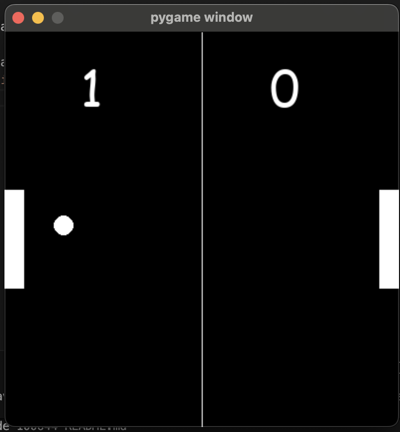

# 🏓 Pong Game (Pygame)



A simple **Pong-style game** built using **Python** and **Pygame**.  
This project demonstrates basic game mechanics such as movement, collision detection, scoring, and rendering using Pygame.

---

## 📌 Features

- Two paddles (left and right)
- Ball movement with collision physics
- Score tracking for both players
- Automatic paddle selection based on ball direction
- Game resets when a player reaches 10 points
- Simple keyboard controls

---

## 🛠️ Requirements

Make sure you have **Python 3.x** installed.

Install the required library:

```bash
pip install pygame
